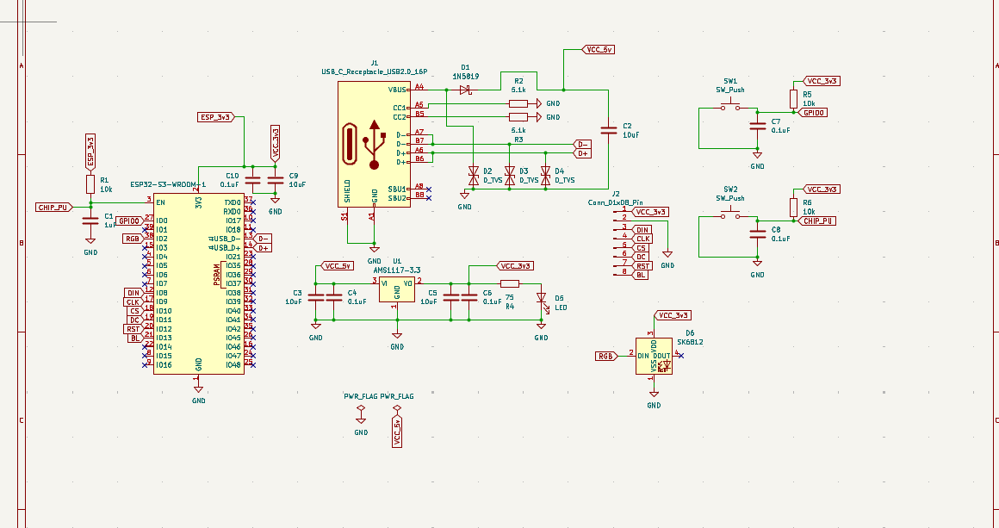
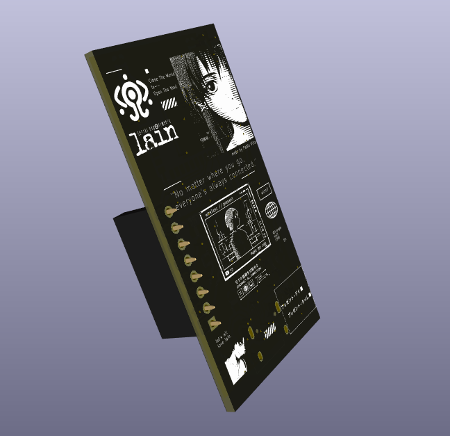

# Serial-Experiments-Lain-DevBoard

let's all love lain.

A custom ESP32-C3 dev board built as a appreciation  to Serial Experiments Lain. Not a Lain branded case for a stock dev board  this is a from-scratch PCB with its own connector layout, onboard RGB status LED, and just enough buttons to feel like a piece of hardware from the Wired.

Also I just wanted an excuse to build a PCB.

Hardware
MCU: ESP32-C3 — WiFi/BLE, RISC-V single-core, low power draw for anything battery-powered
USB-C: native USB-C receptacle (16-pin), no more digging through a drawer for the right cable
Status LED: onboard SK6812 addressable RGB — Present indicator, whatever color the Wired feels like that day
Buttons: 2x SMD tactile switches, low-profile, doesn't add bulk to the silhouette
Power: 3.3V regulated, USB-powered or battery-ready depending on the build

Full BOM and sourcing notes live in /hardware.
